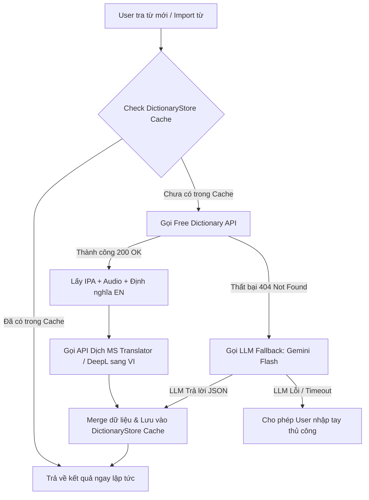

# Kế hoạch Dự án: Hệ thống Học Ngôn ngữ (English MVP) - Bản Cập nhật v2.0

> **Phiên bản:** 2.0 (Đã chỉnh sửa & bổ sung dựa trên đánh giá kiến trúc)  
> **Tech Stack:** React + Node.js/Express + MongoDB (TypeScript Monorepo)  
> **Kiến trúc:** Language-agnostic, Async Background Processing, SRS FSRS Engine  

---

## 1. Định vị sản phẩm & Nguyên tắc Thiết kế

* **Đối tượng chính:** Người dùng phổ thông, học viên mọi lứa tuổi.
* **Điểm khác biệt:** Nội dung chất lượng, giải thích bằng tiếng Việt, ví dụ gần gũi với ngữ cảnh người Việt.
* **Kiến trúc dài hạn (Language-agnostic):** Mọi nội dung (Deck, Card, Dictionary) đều gắn `langCode`. Dữ liệu đa ngữ lưu dưới dạng danh sách mảng ngôn ngữ (`meanings: [{ langCode, text }]`), không hardcode bất kỳ ngôn ngữ cụ thể nào.

---

## 2. Tech Stack & Kiến trúc Hạ tầng

| Tầng | Công nghệ lựa chọn | Ghi chú & Cấu hình |
| :--- | :--- | :--- |
| **Frontend** | React 18 + Vite + TypeScript + Tailwind CSS + shadcn/ui | Triển khai trên **Vercel** |
| **State/Data** | TanStack Query (React Query) + Zustand | TanStack Query cho server state, Zustand cho UI state |
| **Backend** | Node.js + Express + TypeScript | Triển khai trên **Render** (dùng UptimeRobot ping 10p/lần để giữ warm) |
| **Database** | MongoDB Atlas + Mongoose | Free tier M0 (512MB), có chiến lược archive log cũ khi scale |
| **Auth** | JWT + Refresh Token (HttpOnly Cookie) | `SameSite=None; Secure` + CORS Whitelist `credentials: true` |
| **Media Storage** | Cloudinary Free Tier (25GB) | Lưu trữ hình ảnh và file audio do User upload/tạo riêng |
| **TTS & Speech** | Web Speech API (Browser) + Google Cloud TTS (Fallback) | Web Speech API mặc định, Google TTS cho câu dài/Accent |
| **Async Queue** | BullMQ + Redis (hoặc Agenda.js cho MongoDB) | Xử lý import CSV & enrich dữ liệu từ vựng bất đồng bộ |

---

## 3. Actors & Quyền Hạn Trong Hệ Thống

1. **Guest (Khách):**
   * Xem Landing page, các Deck/Quiz ở trạng thái `isPublic: true`.
   * Đăng ký, đăng nhập. Không lưu tiến độ học.
2. **Learner (Học viên - Core Actor):**
   * Quản lý thông tin cá nhân, chọn ngôn ngữ đích & thiết lập Timezone.
   * Học Flashcard theo thuật toán SRS (đánh giá `Again` / `Hard` / `Good` / `Easy`).
   * Tạo, sửa, xóa Deck & Card cá nhân; Import CSV (xử lý bất đồng bộ).
   * Làm Quiz, xem lịch sử làm bài, giải thích đáp án.
   * Xem thống kê cá nhân (Streak, XP, Level, Bảng tiến độ FSRS).
3. **Admin (Quản trị viên):**
   * Quản lý tài khoản người dùng (Khóa/Mở khóa, Phân quyền).
   * Quản lý nội dung chính thức (Deck chuẩn như Oxford 3000, TOEIC 600...).
   * Duyệt hoặc quản lý các Deck công khai do User đóng góp (`status: 'draft' | 'pending' | 'approved'`).
   * Xem Dashboard thống kê hệ thống (User active, số session/ngày, tỉ lệ hoàn thành bài học).

---

## 4. Thiết kế Data Model Cốt lõi (Core Schemas)

### 4.1. User & Auth Schema
```typescript
User {
  _id: ObjectId,
  email: string,           // Unique, index
  passwordHash: string,
  name: string,
  nativeLang: string,      // e.g. 'vi'
  targetLangs: string[],   // e.g. ['en', 'ja']
  timezone: string,        // e.g. 'Asia/Ho_Chi_Minh' để tính Streak
  xp: number,              // Default 0
  streak: {
    current: number,
    lastLearnedDate: string // YYYY-MM-DD theo timezone
  },
  role: 'learner' | 'admin',
  createdAt: Date
}
```

### 4.2. SRS & Flashcard Schemas (Tách biệt State và Log)

#### A. Deck Collection
```typescript
Deck {
  _id: ObjectId,
  ownerId: ObjectId,       // User tạo deck (hoặc Admin)
  langCode: string,        // Ngôn ngữ đích (e.g. 'en')
  title: string,
  description: string,
  isPublic: boolean,
  status: 'draft' | 'pending' | 'approved',
  tags: string[],
  cardCount: number,
  createdAt: Date
}
```

#### B. Card Collection
```typescript
Card {
  _id: ObjectId,
  deckId: ObjectId,        // Index
  langCode: string,
  term: string,            // Từ gốc (e.g. 'hello')
  ipa: { us?: string, uk?: string },
  meanings: Array<{
    langCode: string,      // e.g. 'vi'
    text: string           // e.g. 'Xin chào'
  }>,
  examples: Array<{
    en: string,
    vi?: string
  }>,
  audioUrl?: string,       // Cloudinary URL hoặc External URL
  imageUrl?: string,       // Cloudinary URL
  createdAt: Date
}
```

#### C. UserCardState Collection (Trạng thái SRS Hiện tại - 1 row / user-card)
```typescript
UserCardState {
  _id: ObjectId,
  userId: ObjectId,        // Index kép (userId, cardId) - Unique
  cardId: ObjectId,
  deckId: ObjectId,
  state: 'new' | 'learning' | 'review' | 'relearning',
  // Các thông số thuật toán FSRS
  stability: number,       // Độ bền trí nhớ
  difficulty: number,      // Độ khó của từ
  elapsedDays: number,     // Số ngày từ lần ôn trước
  scheduledDays: number,   // Số ngày hẹn ôn tiếp theo
  reps: number,            // Số lần đã ôn
  lapses: number,          // Số lần quên (đánh giá Again)
  due: Date,               // Thời điểm cần ôn tiếp theo (Index)
  lastReview?: Date,
  updatedAt: Date
}
```

#### D. Review Collection (Nhật ký Ôn tập - Append-only Log)
```typescript
Review {
  _id: ObjectId,
  userId: ObjectId,        // Index
  cardId: ObjectId,
  rating: 1 | 2 | 3 | 4,   // 1: Again, 2: Hard, 3: Good, 4: Easy
  stateBefore: string,
  stateAfter: string,
  reviewedAt: Date
}
```

### 4.3. Global Dictionary Cache Collection
```typescript
DictionaryStore {
  _id: ObjectId,
  word: string,            // Index unique (lowercase)
  langCode: string,        // e.g. 'en'
  ipa: { us?: string, uk?: string },
  audioUrl: { us?: string, uk?: string },
  meanings: Array<{
    partOfSpeech: string,
    definitions: Array<{
      definition: string,
      example?: string
    }>
  }>,
  translations: Array<{
    langCode: string,      // e.g. 'vi'
    text: string
  }>,
  source: 'dictionary_api' | 'llm_fallback' | 'manual',
  updatedAt: Date
}
```

### 4.4. Quiz & Question Schemas (Discriminated Union)

#### A. Quiz Collection
```typescript
Quiz {
  _id: ObjectId,
  topicId?: ObjectId,
  sourceDeckId?: ObjectId, // Nguồn deck auto-generate (nếu có)
  langCode: string,
  title: string,
  questionCount: number,
  timeLimit: number,       // Giây (0 = không giới hạn)
  createdAt: Date
}
```

#### B. Question Collection (Discriminated Union)
```typescript
Question {
  _id: ObjectId,
  quizId: ObjectId,        // Index
  type: 'mcq' | 'fill_blank' | 'matching' | 'listening' | 'ordering',
  prompt: string,
  audioUrl?: string,       // Dùng cho dạng câu hỏi listening
  payload: 
    | { type: 'mcq', options: string[], answerIndex: number }
    | { type: 'fill_blank', answer: string, caseSensitive?: boolean }
    | { type: 'matching', pairs: Array<{ left: string, right: string }> }
    | { type: 'listening', options: string[], answerIndex: number }
    | { type: 'ordering', items: string[], correctOrder: number[] },
  explanation: string
}
```

#### C. QuizAttempt Collection
```typescript
Attempt {
  _id: ObjectId,
  userId: ObjectId,
  quizId: ObjectId,
  score: number,
  answers: Array<{
    questionId: ObjectId,
    userAnswer: any,
    isCorrect: boolean
  }>,
  timeSpent: number,        // Giây
  createdAt: Date
}
```

---

## 5. Luồng Xử lý Dữ liệu & Tích hợp API

### 5.1. Quy trình Tra từ & Fallback 3 Tầng (Dictionary Pipeline)


### 5.2. Luồng Import CSV Bất đồng bộ (Async Import)
1. **Bước 1 (Synchronous):** User upload CSV $\rightarrow$ Backend validate cấu trúc file $\rightarrow$ Lưu ngay các thông tin cơ bản của Card (`term`, `meaning`) vào DB với trạng thái đính kèm $\rightarrow$ Trả về phản hồi cho FE: *"Upload thành công X từ, hệ thống đang làm giàu dữ liệu phiên âm/âm thanh ở background"*.
2. **Bước 2 (Background Processing):** Worker ngầm duyệt từng từ $\rightarrow$ Gọi quy trình tra từ ở Mục 5.1 để bổ sung IPA, Audio, Ví dụ $\rightarrow$ Cập nhật thông tin hoàn chỉnh vào `Card`.

---

## 6. Logic Gamification (Streak & XP Rules)

* **Quy tắc XP:**
  * Học 1 card SRS đạt `Good` hoặc `Easy`: **+10 XP**
  * Trả lời đúng 1 câu hỏi Quiz: **+5 XP**
* **Quy tắc Streak:**
  * Học viên hoàn thành tối thiểu **1 session** (SRS hoặc Quiz) trong ngày sẽ giữ/tăng Streak thêm 1 ngày.
  * Mốc thời gian ngày mới được tính theo `timezone` thiết lập trong Profile của người dùng (ví dụ: `Asia/Ho_Chi_Minh` thiết lập 00:00).
* **Quy tắc Level (Cấp độ):**
  $$\text{Level} = \lfloor \sqrt{\text{XP} / 100} \rfloor$$
  * *Ví dụ:* 0–99 XP = Level 0; 100–399 XP = Level 1; 400–899 XP = Level 2; 900–1599 XP = Level 3...

---

## 7. Lộ trình Triển khai (Roadmap)

> **Dự kiến thời gian:** 6 tuần (Full-time) hoặc 12 tuần (Part-time)

* **Phase 1: Setup Infrastructure & Monorepo (Tuần 1)**
  * Cấu hình Monorepo `pnpm` + Turborepo (`@app/frontend`, `@app/backend`, `@app/shared`).
  * Khởi tạo Express Server + TypeScript + Connection MongoDB Atlas.
  * Triển khai Auth System với JWT HttpOnly Cookie (`SameSite=None; Secure`) + Refresh Token flow.
* **Phase 2: Flashcard Core & FSRS SRS Engine (Tuần 2 - 3)**
  * Dựng CRUD Deck & Card + Tích hợp Cloudinary upload ảnh/audio.
  * Cài đặt package `ts-fsrs`, xây dựng logic tính toán SRS trong `UserCardState`.
  * Dựng giao diện học Flashcard mượt mà (lật thẻ, chấm nút Again/Hard/Good/Easy).
  * Viết script seed dataset 3000 từ chuẩn (Oxford 3000).
* **Phase 3: Dictionary Pipeline & Async CSV Import (Tuần 4)**
  * Xây dựng collection `DictionaryStore` và luồng fallback (Free Dictionary API $\rightarrow$ Gemini Flash $\rightarrow$ User entry).
  * Xử lý Import CSV bất đồng bộ.
* **Phase 4: Quiz Module & Gamification (Tuần 5)**
  * Triển khai Quiz Engine hỗ trợ các loại câu hỏi (MCQ, Fill-blank, Matching, Listening, Ordering).
  * Tích hợp logic XP, Streak, Level và hiển thị trang thống kê cá nhân.
* **Phase 5: Polishing, Admin Dashboard & Deployment (Tuần 6)**
  * Xây dựng Admin Dashboard (Thống kê User, duyệt Public Deck).
  * Setup UptimeRobot giữ warm Render Backend.
  * Kiểm thử toàn diện & Deploy chính thức Vercel + Render.
